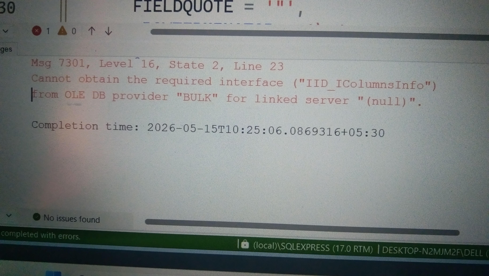

# BULK INSERT Error in SQL Server - Fixed 
### Problem 1 
First time i downloaded Data from **Kaggle** and started BULK INSERT,    
While trying to load a CSV file using BULK INSERT,I got this Error :  


**Error Message Screenshot**  
#### My Solved Query  
  
``` SQL

BULK INSERT bronze.orders
FROM 'C:\tmp\train.csv'
WITH (
       FORMAT = 'CSV',
       FIRSTROW = 2,
       FIELDTERMINATOR = ',',
       FIELDQUOTE = '"',
    -- ROWTERMINATOR = '\n', This was the problem
       ROWTERMINATOR = '0x0a', -- This is solution
       TABLOCK
 );
```
**Just Changed the ROWTERMINATOR and it worked perfectly!**  
### Quick Tips for Beginners   
- Use ROWTERMINATOR = '0x0A' Best for most **Downloaded** CSV files
- Use ROWTERMINATOR = '\n' Good for normal Windows created files
- You can check line endings of your file using **Notepad++**
### More Small But Helpfull Tips For Beginners Like Me To Handle Errors  
1. If Date in any Date column is not in the format 'YYYY-MM-DD', 
 then it will throw an error during bulk insert or Data Migration.
 To avoid this error during	CSV TO SQL SERVER Data insert operation,
 We can use the Data type as VARCHAR for Date columns in the SQL Server table.
 Later we can easily conver Data type VARCHAR TO DATE.

2. Open row csv in excel and check for any column that have big length . first use 
excel LEN function to find the length of that column then set VARCHAR(150) or VARCHAR(100) ,According the length .
don't just assume tha length by yourself and give varchar(100) or varchar(80). there could be some values that
have more than 100 characters. and it will throw and error but other data will be inserted successfully.
and as a begginer we might not know that some rows are not inserted.

 3. If we have decimal values in a numerical column,and we set the data type as INT then it
 will throw an error during bulk insert or Data Migration. so for this type of data ,ideal data type 
 is DECIMAL() or FLOAT.

4. First open row csv file in excel for understanding the data.
then we can decide the data type for each column in SQL Server table.
Just opening and seeing row file in VS code is not enough for beginners to understand the data .


